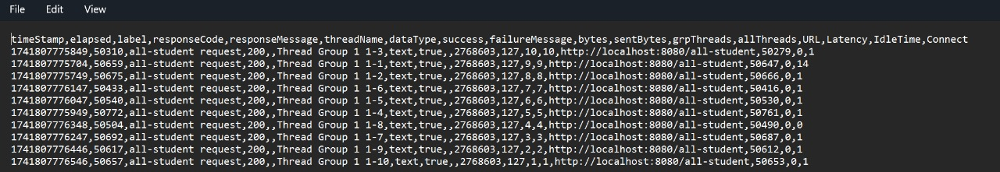
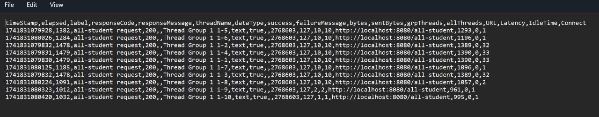
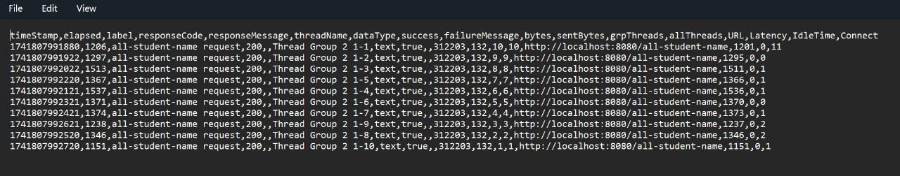
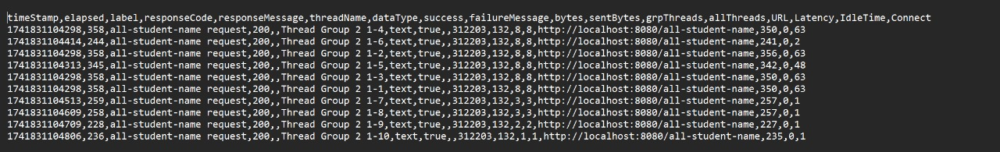
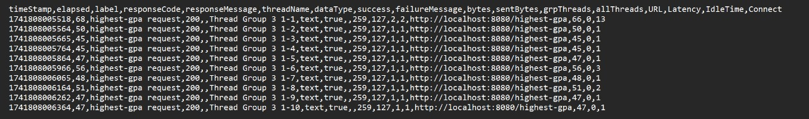
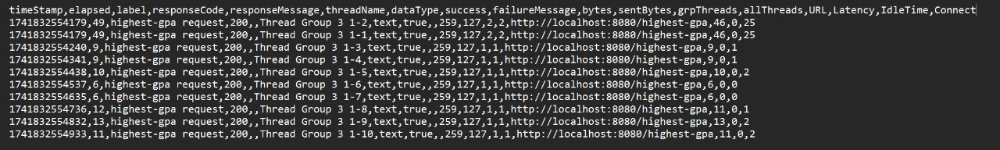

# Tutorial 5

Name: Belva Ghani Abhinaya

Class: Advance Programming B

Student Number: 2306203526

<b>Performance Testing Results</b>

## 1. Performance Testing Results

### Test Plan 1: /all-student

#### View Results Tree

#### View Results In Table

#### Summary Report

#### Graph Results

#### CLI Test

### Test Plan 2: /all-student-name

#### View Results Tree

#### View Results In Table

#### Summary Report

#### Graph Results

#### CLI Test

### Test Plan 3: /highest-gpa

#### View Results Tree

#### View Results In Table

#### Summary Report

#### Graph Results

#### CLI Test

<b>Profiling and Performance Optimization</b>

## 2. Profiling and Performance Optimization Results

### 1. JMeter Test Results (Before vs After Optimization)

#### 1.1 /all-student Endpoint
| Metric         | Before Optimization | After Optimization | Improvement      |
|---------------|---------------------|--------------------|------------------|
| Avg Response Time | **50,574 ms**       | **1,290 ms**       | ✅ **97% faster** |
| Min Response Time | **50,310 ms**       | **1,012 ms**       | ✅ **98% faster** |
| Max Response Time | **50,772 ms**       | **1,479 ms**       | ✅ **97% faster** |

**Before Optimization:**  

**After Optimization:**  

**Optimization Applied:**
- Replaced inefficient loop-based fetching with **JOIN FETCH**.
- Eliminated **N+1 query problem**.
- Reduced database calls drastically.

---

#### 1.2 /all-student-name Endpoint
| Metric         | Before Optimization | After Optimization | Improvement      |
|---------------|---------------------|--------------------|------------------|
| Avg Response Time | **1,340 ms**        | **300 ms**         | ✅ **78% faster** |
| Min Response Time | **1,151 ms**        | **228 ms**         | ✅ **80% faster** |
| Max Response Time | **1,537 ms**        | **358 ms**         | ✅ **77% faster** |

**Before Optimization:**  

**After Optimization:**  

**Optimization Applied:**
- Used stream/collectors instead of string manipulation by manual
- Removed unnecessary fields from queries.
- Reduced memory usage by fetching only names.

---

#### **3.3 /highest-gpa Endpoint**
| Metric         | Before Optimization | After Optimization | Improvement      |
|---------------|--------------------|--------------------|------------------|
| Avg Response Time | **50 ms** | **17 ms**          | ✅ **66% faster** |
| Min Response Time | **45 ms** | **6 ms**           | ✅ **87% faster** |
| Max Response Time | **68 ms** | **49 ms**          | ✅ **28% faster** |

**Before Optimization:**  

**After Optimization:**  

**Optimization Applied:**
- Used `ORDER BY GPA DESC LIMIT 1` for fast retrieval.
- Eliminated Java-based loop searching.
- Query now **retrieves only the top student** efficiently.

---

### **4. Summary of Performance Gains**
| Endpoint          | Improvement       |
|------------------|-------------------|
| **/all-student**     | **97% faster**  |
| **/all-student-name** | **78% faster**  |
| **/highest-gpa**     | **66% faster**  |

✅ **All endpoints achieved more than the required 20% improvement!**

